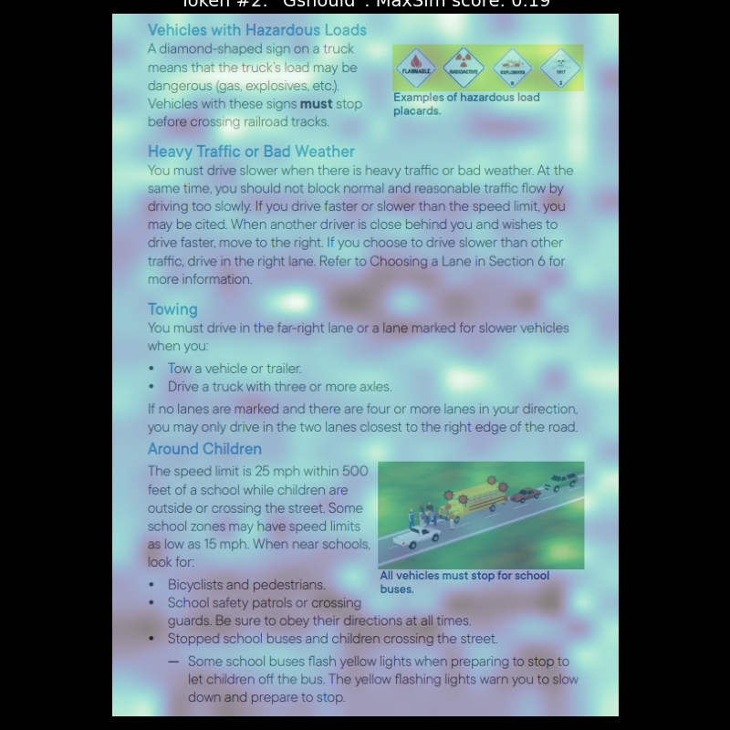

# VLM-Based-Retrieval-Augmented-Generation

Stanford NLP Project Repo 

VLM RAG pipeline based on [CoPali](https://arxiv.org/pdf/2407.01449).

## Interpretable MaxSim Mapping:
<div style="display: flex; justify-content: center;">
    
    
</div>

## Project Structure Tree:
```
VLM RAG/
│
├── benchmark_run_metrics/        # ranking metrics for benchmark
│   ├── datasetName/
│       └── metrics.json           
│
├── codes/
│   ├── finetune.py               # script for fine-tuning retriever using contrastive learning
│   ├── run_benchmark.py          # script to run model on benchmark
│   └── utils                     # util functions
│
├── interpreted_output            # heatmap visualizing visual attention   
|
├── main/                         # main rag pipeline
│   ├── dbManager.py              # script for article vectorization
│   ├── gen.py                    # script for inference and synthetic question generation
│   ├── preprocessor.py           # script for doc preprocessing
│   └── pipeline.py               # script for RAG pipeline
│
├── dmv_example.png               # example image used for interpretable similarity mapping  
|
├── requirements.txt              # Python dependencies
```
