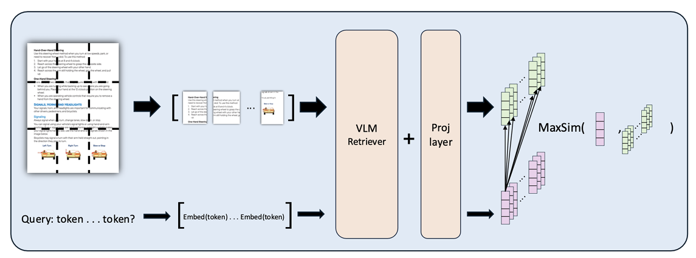
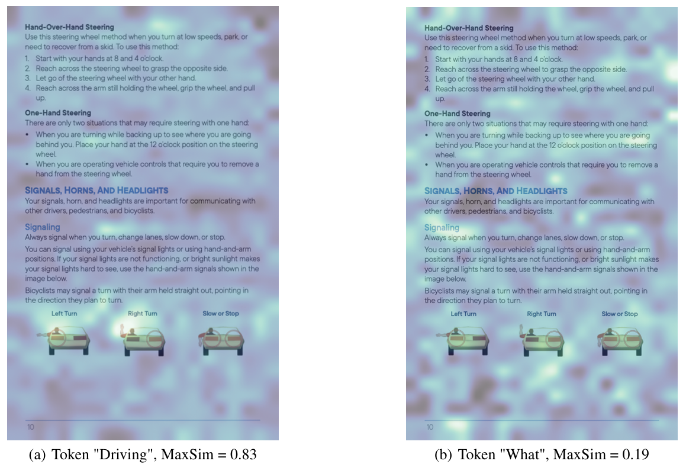

# VisionRAG: Acing DMV test with Multimodal Retrieval Augmented Generation

Stanford NLP Project Repo. VLM RAG pipeline based on [CoPali](https://arxiv.org/pdf/2407.01449).

Traditional text-based retrieval struggles with visually rich documents, where key
information is embedded in layouts, tables, and figures. Text-based approaches
often lose visual context, leading to degraded retrieval accuracy. To address this, we
propose a Vision-based Retrieval-Augmented Generation (Vision-RAG) framework
that directly processes document images using Vision Language Models (VLMs),
bypassing OCR and preserving both textual and visual context. In this project, we
implement and evaluate a Vision-RAG pipeline, where a vision-based retriever
selects relevant document images and a generative model answers user queries. We
conduct experiments on the ViDoRe benchmark, a dataset specifically designed
for multimodal document retrieval and our custom dataset, and a testset containing real multiple choice practice questions related to driver's liscence test. Key findings include:

- We implement and evaluate a Vision-RAG pipeline that directly processes document images without parsing, avoiding OCR-related errors and preserving visual context.
- We compare our Vision-RAG approach against text-based retrieval baselines and demonstrate its robustness on text-based documents and superiority in understanding document's visual information.
- We fine-tune a lightweight VLM retriever using contrastive learning with LoRA, further boosting retrieval and end-to-end performance.
- We incorporate query expansion and Chain-of-Thought (CoT) reasoning to refine retrieval quality and improve response coherence.

## Pipeline:
<div style="display: flex; justify-content: center;">
    <div style="text-align: center;">
        
    </div>
</div>


## Interpretable MaxSim Mapping:
Query: What is the hand-and-arm signal used for tuning right while driving?

<div style="display: flex; justify-content: center;">
    <div style="text-align: center;">
        <p><strong>Token-level MaxSim-Score </strong></p>
        
    </div>
</div>
The attention graph for token-level MaxSim calculated from query "What is the hand-and-arm signal used for turning right while driving?" The document page is encoded as a sequence of 21 * 34 patches, and each word in the query represents a token. Highlighted part denotes higher MaxSim score.

## Project Structure Tree:
```
VLM RAG/
│
├── benchmark_run_metrics/        # ranking metrics for benchmark
│   └── datasetName/
│       └── metrics.json           
│
├── codes/
│   ├── finetune.py               # script for fine-tuning retriever using contrastive learning
│   ├── run_benchmark.py          # script to run model on benchmark
│   ├── interpretability.py       # script for attention visualization
│   └── utils                     # util functions
│
├── interpreted_output            # heatmap visualizing visual attention   
|
├── trained_models_checkpoint/
│   └── model files
|
├── main/                         # main rag pipeline
│   ├── dbManager.py              # script for article vectorization
│   ├── gen.py                    # script for inference and synthetic question generation
│   ├── preprocessor.py           # script for doc preprocessing
│   ├── get_data.py               # scraper for evaluation set
│   └── pipeline.py               # script for RAG pipeline
│
├── dmv_example.png               # example image used for interpretable similarity mapping  
|
├── requirements.txt              # Python dependencies
```
